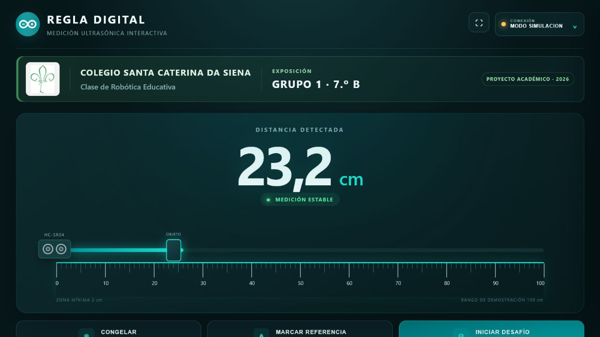
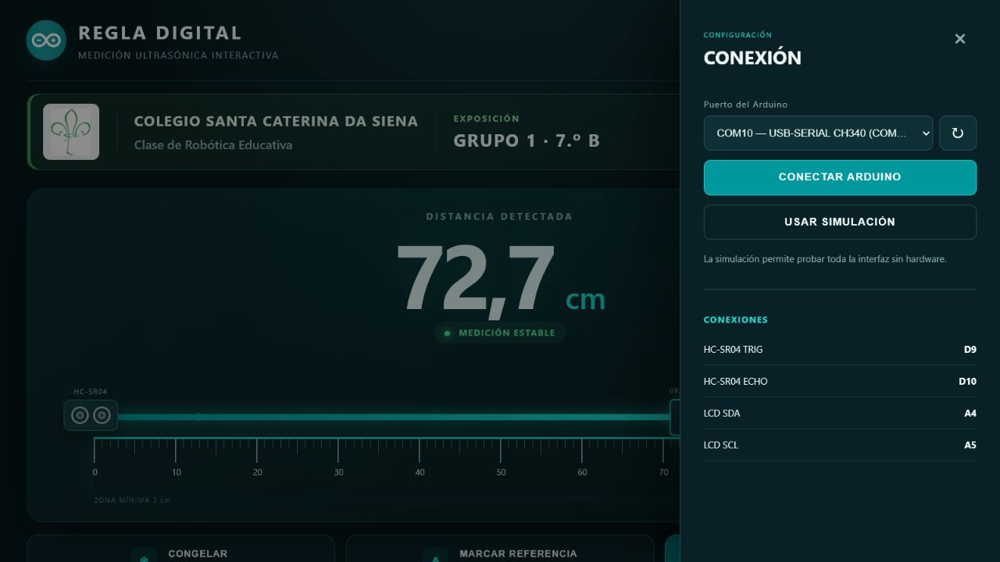

# Regla Digital Arduino

Herramienta visual e interactiva para medir distancias con Arduino UNO, sensor HC-SR04 y LCD 16×2 I2C. Fue desarrollada para la exposición del **Grupo 1 del 7.º B**, dentro de la **Clase de Robótica Educativa del Colegio Santa Caterina Da Siena**.



## Descarga portable

La opción recomendada para la computadora de exposición es descargar [`ReglaDigitalPortable.zip`](https://github.com/hfreedo/Regla-digital-ultrasonica/releases/latest/download/ReglaDigitalPortable.zip).

Después de descomprimirlo, ejecutar:

```text
ReglaDigitalPortable/ReglaDigital.exe
```

No requiere instalar Python. Solo necesita Windows, un navegador moderno y el driver USB correspondiente a la placa Arduino.

Las instrucciones que acompañan al ejecutable también pueden consultarse en [`docs/LEEME_PRIMERO.md`](docs/LEEME_PRIMERO.md).

## Funciones

- Medición central de gran tamaño, visible durante la exposición.
- Regla graduada animada de 0 a 100 cm.
- Barra, objeto y ondas ultrasónicas en tiempo real.
- Lecturas filtradas y estados de estabilidad o ausencia de objeto.
- Congelación de una lectura.
- Referencia y diferencia entre dos posiciones.
- Desafío para alcanzar una distancia aleatoria.
- Modo de simulación para demostrar la interfaz sin hardware.
- Selección y conexión del puerto COM desde la aplicación.



## Hardware

- Arduino UNO.
- Sensor ultrasónico HC-SR04.
- LCD 16×2 con adaptador I2C.
- Cable USB de datos.
- Cables de conexión.

## Conexiones

| Componente | Arduino UNO |
|---|---|
| HC-SR04 TRIG | D9 |
| HC-SR04 ECHO | D10 |
| LCD SDA | A4 |
| LCD SCL | A5 |
| Alimentación | 5V y GND común |

El firmware utiliza inicialmente la dirección I2C `0x27` y comunicación serial a `9600` baudios.

## Preparar el Arduino

1. Instalar `LiquidCrystal I2C` desde el Administrador de bibliotecas del Arduino IDE.
2. Abrir [`arduino/regla_digital/regla_digital.ino`](arduino/regla_digital/regla_digital.ino).
3. Seleccionar Arduino UNO y el puerto correspondiente.
4. Cargar el programa.
5. Cerrar el Monitor Serie antes de usar la aplicación.

El firmware toma cinco muestras, descarta valores fuera del rango de 2 a 100 cm y utiliza la mediana para reducir saltos. Envía una medición JSON cada 100 ms.

## Ejecutar desde el código fuente

```powershell
python -m pip install -r requirements.txt
python app.py
```

La aplicación abre automáticamente `http://127.0.0.1:8766`.

## Generar nuevamente el paquete

En Windows, ejecutar:

```text
tools/build_portable.bat
```

El proceso instala las herramientas de construcción, crea `dist/ReglaDigital.exe`, organiza el paquete portable y genera `ReglaDigitalPortable.zip` en la raíz del repositorio.

## Estructura principal

```text
arduino/regla_digital/       Firmware del Arduino
static/                       Interfaz HTML, CSS y JavaScript
docs/                         Capturas y documentación
tools/build_portable.py       Construcción reproducible
app.py                        Servidor local y conexión serial
ReglaDigitalPortable.zip      Paquete listo para exposición
```

## Alcance

El sistema mide la distancia desde la cara del HC-SR04 hasta una superficie; no determina directamente la longitud completa de un objeto. Para una demostración fiable se recomiendan objetos planos, rígidos y perpendiculares al sensor, entre 3 y 100 cm.

## Licencia y derechos

Copyright © 2026 Clase de Robótica Educativa del Colegio Santa Caterina Da Siena. Todos los derechos reservados. Consultar [`LICENSE.md`](LICENSE.md).
